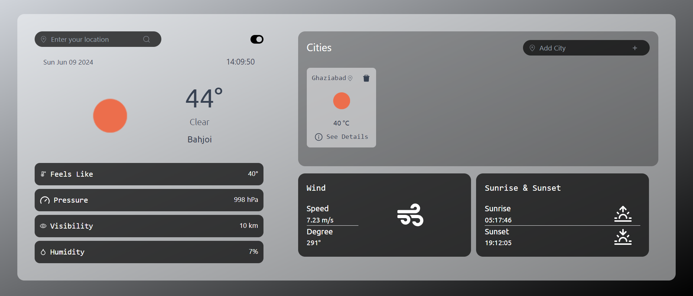
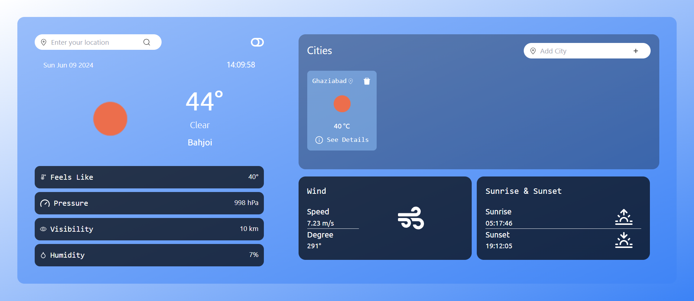
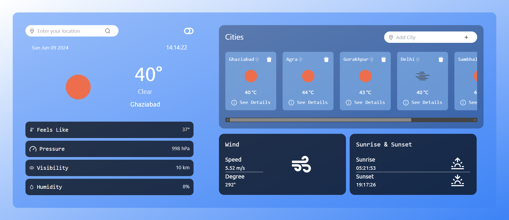

# Weather Dashboard



This project is a weather dashboard built with React.js. It allows users to search for weather information of different cities and view various weather parameters such as temperature, humidity, wind speed, sunrise, sunset, etc.

## Features

- **City Search**: Users can search for weather information of any city.
- **Current Weather Display**: Display current weather conditions including temperature, weather description, and icon.
- **Additional Weather Parameters**: View additional weather parameters such as feels like temperature, pressure, visibility, humidity, wind speed, wind degree, sunrise time, and sunset time.
- **Theme Toggle**: Toggle between light and dark themes.
- **City Tracking**: Add multiple cities to track their weather information.
- **Responsive Design**: Seamlessly usable on different devices.

## Screenshots




## Installation

To run this project locally, follow these steps:

1. Clone the repository:

   ```bash
   git clone https://github.com/YashVar304/weatherapi.git
<<<<<<< HEAD
   ```
=======

>>>>>>> 59fe122c86549fb5643f2be6862b0a8a01df850d
